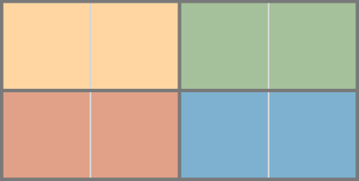
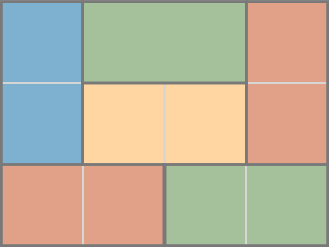

# Paving with tatamis

## Description of the problem

If you rent an apartment or a house in Japan, the size of each room is neither measured in square meters or in square feet but in tatamis. Tatamis are mattresses made of _goza_, or rice straw, that are fixed on wooden frames. People use tatamis to cover the floor of rooms in traditional houses.

A basic student room will measure 6 tatamis, i.e. it is possible to place 6 tatamis in the living room (amenities like bathrooms are not measured). A tatami can be modelled as a rectangle of size 2 × 1, though the size of the tatami is not standard: in Tokyo region, tatamis are smaller (88 × 176 cm) than in Kyoto region (91 × 182 cm).

According to the shape of a room, there are several ways to pave it with tatamis. Apart from obvious constraints stating that tatamis cannot overlap or extend outside of the room, there is a Japanese aesthetic standard rule to follow: no four tatamis shall meet at the same point.

{ width="150px" }

{ width="150px" }

## Paper submission

Solve this problem for a room of width `xmax` and length `ymax` by answering the
following questions.

Submit a document in PDF format and the code as a `tatami_solve.py` file with

1. (3 points) Define the decision variables of the problem (i.e. placement of the lower left corner and orientation for each tatami).

   _Hint: to specify the orientation of a tatami, two variables corresponding respectively to its size along the x-axis and its size along the y-axis can be defined, then constrained together._

2. (2 points) Define two auxiliary variables for each tatami corresponding to the x-coordinate of its right side and to the y-coordinate of its top side.

3. (2 points) Add constraints to prevent tatamis to extend outside of the room.

4. (2 points) Add non-overlapping constraints.

5. (3 points) Break the permutation symmetry among tatamis by lexicographically ordering the coordinates of their lower left corner.

6. (3 points) Add constraints to prevent four tatamis to meet in the same point.

   _Hint: a sufficient condition (if the tatamis are lexicographically ordered) is to forbid that, for any two tatamis `i` < `j`, tatami `i` has its upper right corner meets the lower left corner of tatami `j`._

7. (2 points) If the room is square, add a constraint to break the first diagonal symmetry.

8. (3 points) Define a search goal, using the classic tiling strategy for your placement variables, and solve the problem.

   _Hint: don’t forget to assign the orientation variables as well and graphically check your solution with Matplotlib (or any other tool)._

9. (Bonus) Add redundant capacity constraints for each vertical and horizontal line to lower the resolution time and number of backtracks.

## Code submission

Return a file named `tatami_solve.py` with a function with the following signature. Your code will be automatically evaluated on many problems, including 4×3, 4×4, 5×4, 6×4, 6×5 and 6×6: you will not get any point if you do not follow this simple convention.

```python
def tatami_solve(xmax: int, ymax: int) -> list[facile.Solution]:

    return facile.solve_all([], backtrack=True)
```

A template is given for your convenience. You may run it as:

```bash
python tatami_solve.py  # 4 3
python tatami_solve.py 6 6
```
